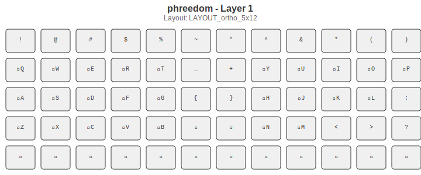

= FreedBoard
:subtitle: A modern keyboard implementation
:toc: left
:toclevels: 3

== Introduction

FreedBoard is a modern keyboard implementation that provides advanced key mapping and modifier handling capabilities.

=== References

* http://retired.beyondlogic.org/keyboard/keybrd.htm
* http://manpages.ubuntu.com/manpages/precise/man8/setkeycodes.8.html
* http://manpages.ubuntu.com/manpages/precise/man1/loadkeys.1.html
* http://manpages.ubuntu.com/manpages/precise/man1/xmodmap.1.html

== Keycodes, KeyPress, KeyRelease

When you hit a key on your keyboard, the linux kernel generates a raw scancode for it (if it is assigned).
Each scancode can be mapped to a keycode.
This is at kernel level.
X has a (quasi) total independent way of mapping keys:
X reads the kernel keycode table at startup,
then maps the keycode to its independent keycode table (it is the same as the kernel keycodes but different :)).
Then each keycode can be mapped to a keysym, i.e. a string which represent a key or suggest an action.
Thus to have our keys fully functional, they need a kernel scancode/keycode plus a X keycode/keysym.
It may seem weird, but X developers have their reason to keep a separate keyboard mapping from the kernel.
It is not difficult at all, just a quite tedious procedure.

=== Key Processing Flow

. Scancode → Keycode (kernel level)
. Keycode → Keysym (X11 level)

== Modifiers

Some modifiers have a right and left version, especially if they are widely separated.
If they are close to the center then maybe only one is needed.

=== Modifier Processing

When a KPress occurs:

. The KeyCode is pushed onto the modifier-stack
. The KPress flag is set

When a KRelease occurs:

. The KPress flag is checked... if set:
   a. The action corresponding to the content of the modifier-stack is performed
   b. Typically the stack is processed in order with the remainder of the stack being the arguments
. The KPress flag is unset
. The modifier-stack is popped
. The popped modifier is placed in the modifier-candidate

This means that any key could be a modifier.

=== Action Pre-process

* Process the stack, O, into a new stack, N
* Pop the first keycode from O into N unmodified
* Pop the remaining keycodes from O, push the meta-key equivalent onto N
* If while processing O,
  any of the meta-keys indicated order independence then the action taken will treat the meta-stack as a set.

=== Typical Stack States and Actions

==== Basic Characters

* [ScanCode]: Look up the KeyCode, send a KeyPress/KeyRelease pair for the KeyCode

==== Shift

* [F3 + ScanCode]: [SHIFT{50} + KeyCode]
* Send a SHIFT-KeyPress, KeyCode-KeyPress, KeyCode-KeyRelease, SHIFT-KeyRelease

==== Ctrl

* [G2 + ScanCode]: [CTRL{37} + KeyCode]
* Send a CTRL-KeyPress, KeyCode-KeyPress, KeyCode-KeyRelease, CTRL-KeyRelease

==== Alt

* [F2 + ScanCode]: [ALT{64} + KeyCode]
* Send a ALT-KeyPress, KeyCode-KeyPress, KeyCode-KeyRelease, ALT-KeyRelease

==== Meta

* [F1 + ScanCode]: [META{} + KeyCode]
* Send a META-KeyPress, KeyCode-KeyPress, KeyCode-KeyRelease, META-KeyRelease

==== Magic

* [G1 + ScanCode]: [MAGI{} + KeyCode]
* Send a MAGI-KeyPress, KeyCode-KeyPress, KeyCode-KeyRelease, MAGI-KeyRelease

==== Function Keys

* [F4 + (1, 2, …, a, b,...)]: [(F1, F2,... FA, FZ)]
* Send a single keycode: F1-KeyPress, F1-KeyRelease

==== Repeat

* [G4 + KeyCode...]: [KeyCode...]
* Repeatedly send the KeyPress for the KeyCode until the next action

==== Layer

* [L2 + KeyCode]: No codes are sent, the keyboard is changed to another Layer

== Keyboard Layouts

The FreedBoard keyboard uses a 5×12 ortholinear layout with 60 keys total, compatible with the Preonic keyboard hardware.

=== Layer 0 - Base Layer

The base layer provides standard QWERTY layout with strategic modifier placement.

=== Layer 1 - Shifted Characters

Layer 1 provides access to shifted characters and symbols.

=== Layer 2 - Advanced/Function Layer

Layer 2 features home-row modifiers and advanced key combinations for efficient typing.

=== Layer 3 - Symbols and Navigation

Layer 3 provides additional symbols and function keys F1-F5.

=== Layer 4 - Function Keys and Navigation

Layer 4 provides function keys and navigation controls including arrow keys and page navigation.

=== Layer 5 - System Functions

Layer 5 contains system functions, boot controls, and audio/media keys.

== Layer Visualization

All keyboard layers have been visualized using the included SVG generation system. Each layer shows:

* Key positions in a 5×12 grid layout
* QMK keycode translations to readable labels
* Layer-specific functionality and modifiers
* Clear visual representation of the FreedBoard layout concept

To regenerate the layer visualizations:

[source,bash]
----
python generate_keyboard_layers.py phreedom.json LAYOUT_ortho_5x12-template.svg
----

== Available Layers

The keyboard supports multiple layers including:

* *CapsLock*
* *NumLock*
* *Plover (steno)*: http://www.openstenoproject.org/plover/
* *Basic*: the default
* *Planck*: https://olkb.com/planck/

See also: https://github.com/qmk/qmk_firmware/blob/master/keyboards/planck/keymaps/default/keymap.c

== Characters Layer

This layer is most like the conventional layer. It follows the default for the Planck keyboard.

== Keyboard JSON Configuration

Based on the layout analysis,
the keyboard configuration follows a 5x12 ortholinear layout (60 keys total)
compatible with the Preonic keyboard format.
The physical layout uses a matrix scanning approach with the following characteristics:

* *keyboard*: "preonic/rev3"
* *layout*: "LAYOUT_ortho_5x12"
* *matrix*: 5 rows × 12 columns = 60 keys
* *layers*: Multiple layers with different key mappings
* *modifiers*: Advanced modifier key handling with stack-based processing
* *compatibility*: QMK firmware compatible

The keyboard supports layer switching, modifier stacking, and advanced key processing
suitable for programmers and power users who prefer ortholinear layouts.
